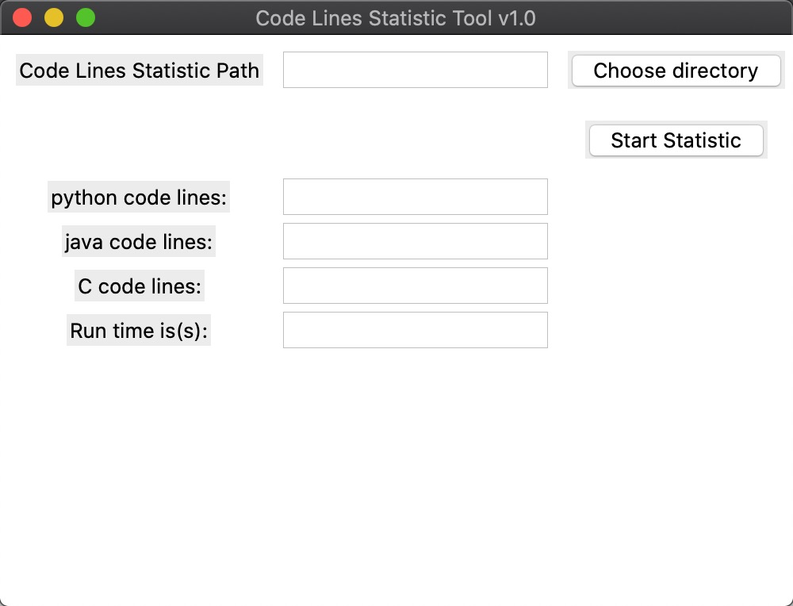
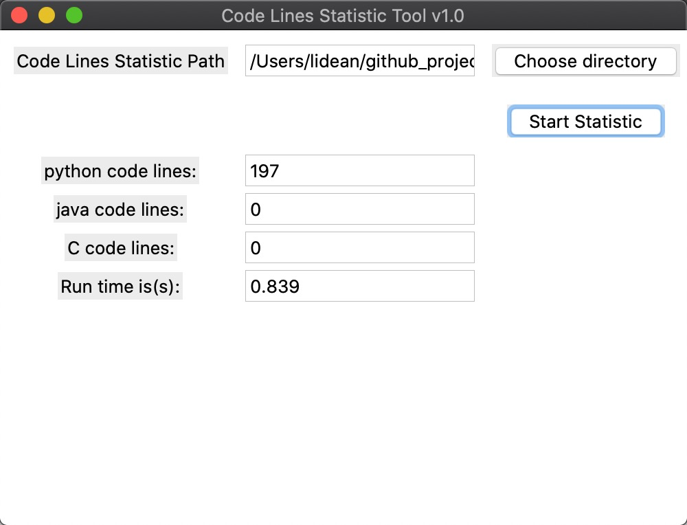

# code-line-statistic

> A code line statistic tool base on tkinter✨💫.


## Usage

```bash
# 安装pipenv
pip3 install pipenv
# 安装项目依赖
pipenv install
# 运行项目
python3 src/main.py
```

## Screenshot





## License

[MIT](https://github.com/YX-XiaoBai/code-line-statistic) license.

Copyright (c) 2020-present YX-XiaoBai
